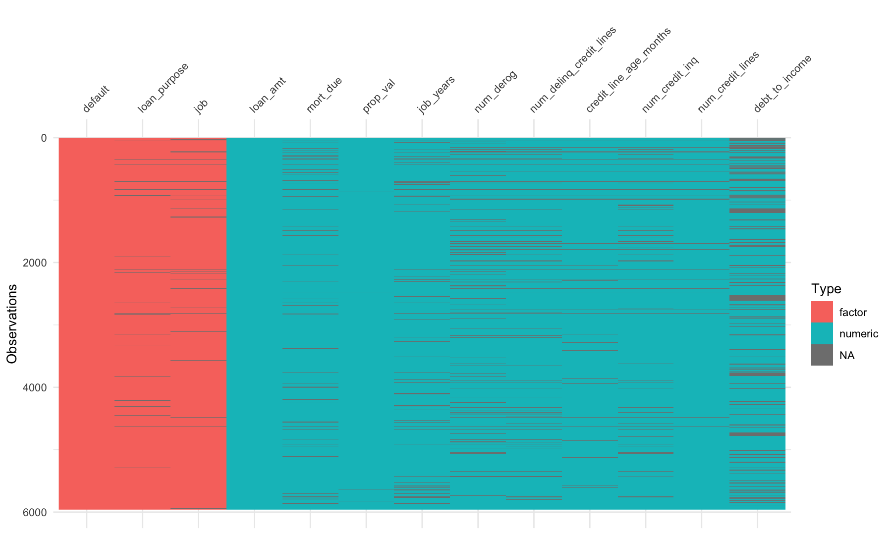
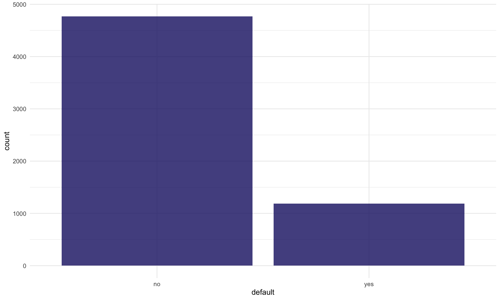
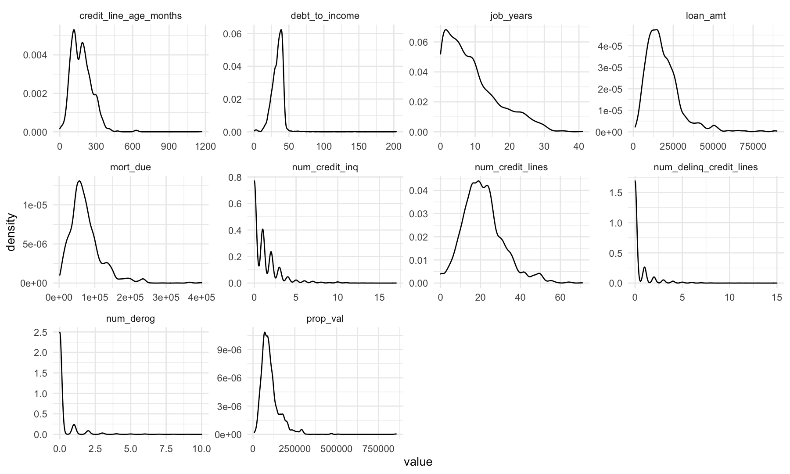
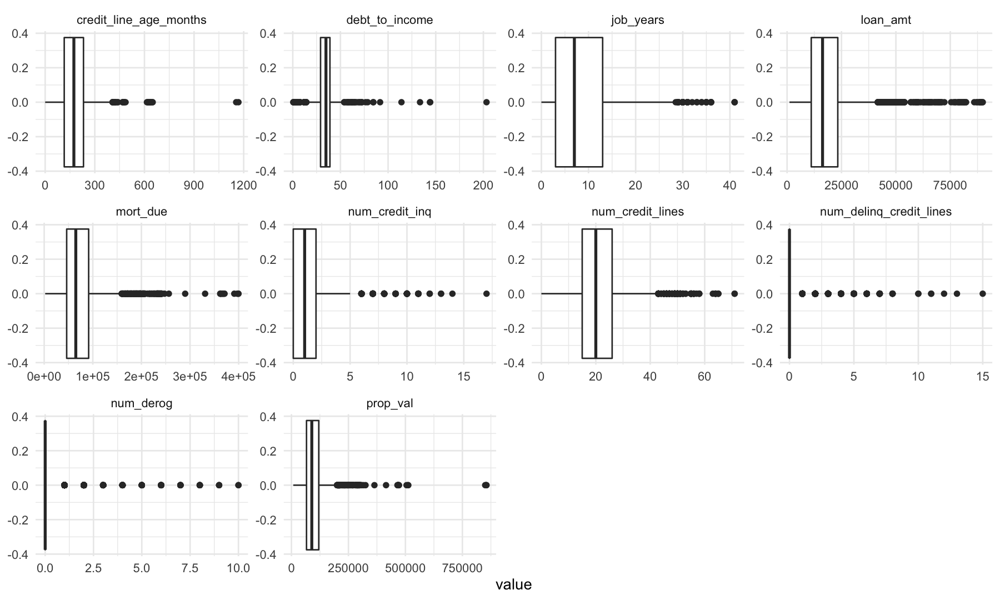
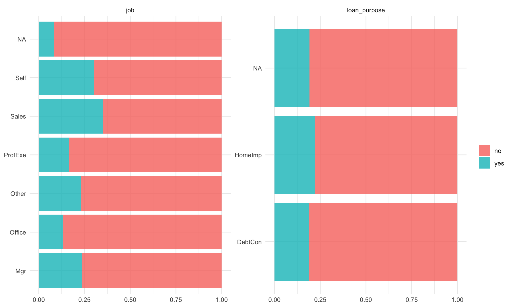
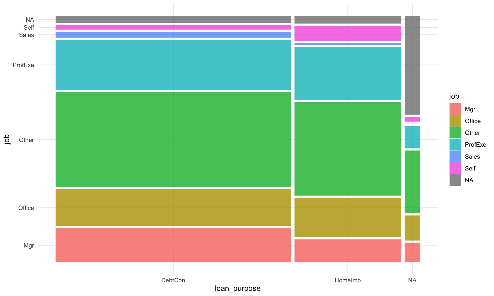
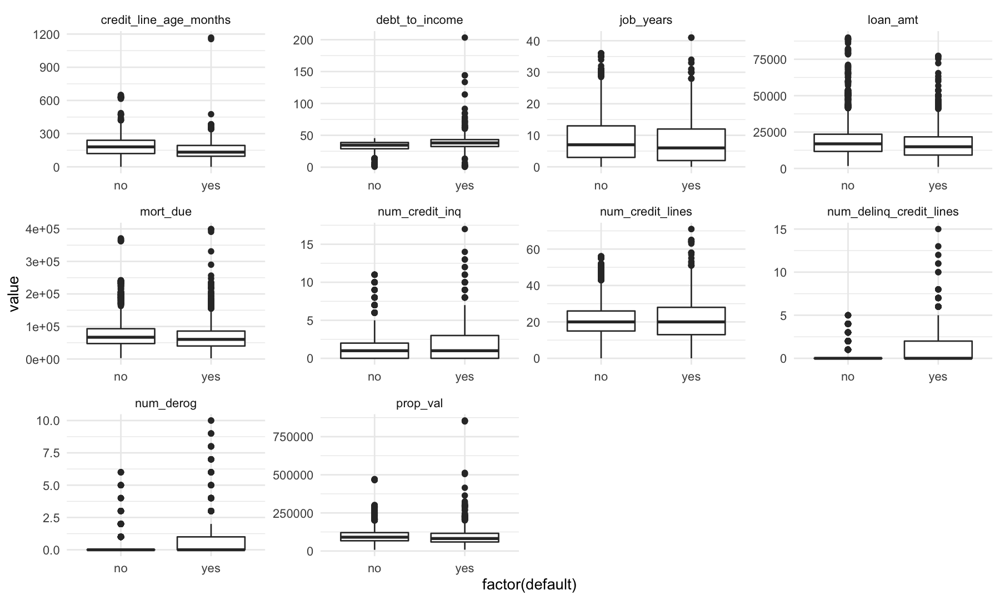
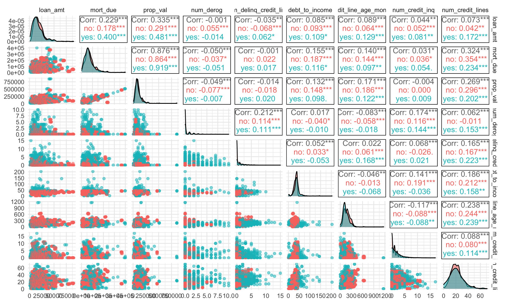
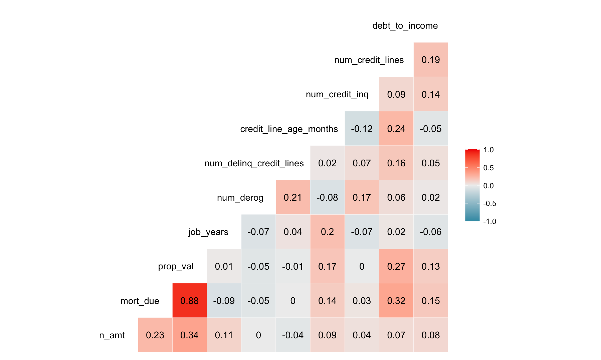

EDA and preprocessing
================
Luke Adams
2021-06-24

**Setup**

``` r
# setup
library(knitr)
knitr::opts_chunk$set(cache = TRUE, cache.lazy = FALSE, warning = FALSE,
                      message = FALSE, echo = TRUE, dpi = 180, 
                      fig.width = 10, fig.height = 6)
library(tidyverse)
library(tidymodels)
theme_set(theme_minimal())
update_geom_defaults('rect', list(fill = 'midnightblue', alpha = 0.8))

library(DALEXtra)
library(lime)
library(GGally)     ## ggcor()

library(here)
library(skimr)
library(janitor)

library(caret)     # nearZeroVar
library(visdat)

# mosaic plot
library(matrixStats)
library(ggmosaic)
```

**Read data**

``` r
# read data
data_00 <- read_csv(here('data', 'hmeq-data-raw.csv'))
```

## Basic EDA

-   5,960 individual loans

-   12 features with **REASON** and **JOB** being categorical

-   **BAD** is our response variable (1 = default, 0 = no default)

-   NAs are present

``` r
# quick look at the data
glimpse(data_00, width = 90)
```

    ## Rows: 5,960
    ## Columns: 13
    ## $ BAD     <dbl> 1, 1, 1, 1, 0, 1, 1, 1, 1, 1, 1, 1, 1, 0, 1, 1, 1, 1, 1, 0, 1, 1, 1, 1, …
    ## $ LOAN    <dbl> 1100, 1300, 1500, 1500, 1700, 1700, 1800, 1800, 2000, 2000, 2000, 2000, …
    ## $ MORTDUE <dbl> 25860, 70053, 13500, NA, 97800, 30548, 48649, 28502, 32700, NA, 22608, 2…
    ## $ VALUE   <dbl> 39025, 68400, 16700, NA, 112000, 40320, 57037, 43034, 46740, 62250, NA, …
    ## $ REASON  <chr> "HomeImp", "HomeImp", "HomeImp", NA, "HomeImp", "HomeImp", "HomeImp", "H…
    ## $ JOB     <chr> "Other", "Other", "Other", NA, "Office", "Other", "Other", "Other", "Oth…
    ## $ YOJ     <dbl> 10.5, 7.0, 4.0, NA, 3.0, 9.0, 5.0, 11.0, 3.0, 16.0, 18.0, 11.0, 3.0, 2.5…
    ## $ DEROG   <dbl> 0, 0, 0, NA, 0, 0, 3, 0, 0, 0, NA, 0, 0, 0, 0, 0, 2, NA, 0, 0, 0, 1, 0, …
    ## $ DELINQ  <dbl> 0, 2, 0, NA, 0, 0, 2, 0, 2, 0, NA, 1, 0, 0, 1, 1, 6, NA, 0, 0, 1, 0, 0, …
    ## $ CLAGE   <dbl> 94.36667, 121.83333, 149.46667, NA, 93.33333, 101.46600, 77.10000, 88.76…
    ## $ NINQ    <dbl> 1, 0, 1, NA, 0, 1, 1, 0, 1, 0, NA, 1, 2, 0, 0, 0, 1, NA, 1, 0, 1, 1, 2, …
    ## $ CLNO    <dbl> 9, 14, 10, NA, 14, 8, 17, 8, 12, 13, NA, 9, 25, 24, 16, 8, 22, NA, 16, 1…
    ## $ DEBTINC <dbl> NA, NA, NA, NA, NA, 37.113614, NA, 36.884894, NA, NA, NA, NA, NA, NA, NA…

**Clean up column names**

``` r
# rename columns for easier interpretability
# clean_names() converts columns to snake case by default
data_01 <-
  data_00 %>% 
  rename(default = BAD, loan_amt = LOAN, mort_due = MORTDUE, prop_val = VALUE, 
         loan_purpose = REASON, job = JOB, job_years = YOJ, num_derog = DEROG,
         num_delinq_credit_lines = DELINQ, credit_line_age_months = CLAGE, 
         num_credit_inq = NINQ, num_credit_lines = CLNO, debt_to_income = DEBTINC) %>% 
  clean_names()
```

**Convert data types**

-   **default**, **loan\_purpose**, **job** to factor variables

-   Recode **default** factors (1 is yes, 0 is no)

``` r
data_02 <- 
  data_01 %>% 
  modify_at(c('default', 'loan_purpose', 'job'), as.factor) %>% 
  mutate(default = recode(default, `1` = 'yes', `0` = 'no'))
```

Save model ready data

``` r
glimpse(data_02, width = 90)
```

    ## Rows: 5,960
    ## Columns: 13
    ## $ default                 <fct> yes, yes, yes, yes, no, yes, yes, yes, yes, yes, yes, ye…
    ## $ loan_amt                <dbl> 1100, 1300, 1500, 1500, 1700, 1700, 1800, 1800, 2000, 20…
    ## $ mort_due                <dbl> 25860, 70053, 13500, NA, 97800, 30548, 48649, 28502, 327…
    ## $ prop_val                <dbl> 39025, 68400, 16700, NA, 112000, 40320, 57037, 43034, 46…
    ## $ loan_purpose            <fct> HomeImp, HomeImp, HomeImp, NA, HomeImp, HomeImp, HomeImp…
    ## $ job                     <fct> Other, Other, Other, NA, Office, Other, Other, Other, Ot…
    ## $ job_years               <dbl> 10.5, 7.0, 4.0, NA, 3.0, 9.0, 5.0, 11.0, 3.0, 16.0, 18.0…
    ## $ num_derog               <dbl> 0, 0, 0, NA, 0, 0, 3, 0, 0, 0, NA, 0, 0, 0, 0, 0, 2, NA,…
    ## $ num_delinq_credit_lines <dbl> 0, 2, 0, NA, 0, 0, 2, 0, 2, 0, NA, 1, 0, 0, 1, 1, 6, NA,…
    ## $ credit_line_age_months  <dbl> 94.36667, 121.83333, 149.46667, NA, 93.33333, 101.46600,…
    ## $ num_credit_inq          <dbl> 1, 0, 1, NA, 0, 1, 1, 0, 1, 0, NA, 1, 2, 0, 0, 0, 1, NA,…
    ## $ num_credit_lines        <dbl> 9, 14, 10, NA, 14, 8, 17, 8, 12, 13, NA, 9, 25, 24, 16, …
    ## $ debt_to_income          <dbl> NA, NA, NA, NA, NA, 37.113614, NA, 36.884894, NA, NA, NA…

``` r
# write_csv(data_02, here('data', 'hmeq-tidy.csv'))
```

**Detailed view**

-   1,189 / 5,960 loans defaulted (\~20%)

-   **loan\_purpose** has 2 unique values, **job** has 6 unique values

-   Missing values are present in all variables except **default** and
    **loan\_amt** with our lowest completion rate being
    **debt\_to\_income** at 78.7%

-   Numeric variables appear to be right skewed based off histograms

-   All numerics are greater than one and maximum values appear
    reasonable for each variable

``` r
skim(data_02) %>% 
  knit_print()
```

|                                                  |          |
|:-------------------------------------------------|:---------|
| Name                                             | data\_02 |
| Number of rows                                   | 5960     |
| Number of columns                                | 13       |
| \_\_\_\_\_\_\_\_\_\_\_\_\_\_\_\_\_\_\_\_\_\_\_   |          |
| Column type frequency:                           |          |
| factor                                           | 3        |
| numeric                                          | 10       |
| \_\_\_\_\_\_\_\_\_\_\_\_\_\_\_\_\_\_\_\_\_\_\_\_ |          |
| Group variables                                  | None     |

Data summary

**Variable type: factor**

| skim\_variable | n\_missing | complete\_rate | ordered | n\_unique | top\_counts                              |
|:---------------|-----------:|---------------:|:--------|----------:|:-----------------------------------------|
| default        |          0 |           1.00 | FALSE   |         2 | no: 4771, yes: 1189                      |
| loan\_purpose  |        252 |           0.96 | FALSE   |         2 | Deb: 3928, Hom: 1780                     |
| job            |        279 |           0.95 | FALSE   |         6 | Oth: 2388, Pro: 1276, Off: 948, Mgr: 767 |

**Variable type: numeric**

| skim\_variable             | n\_missing | complete\_rate |      mean |       sd |      p0 |      p25 |      p50 |       p75 |      p100 | hist  |
|:---------------------------|-----------:|---------------:|----------:|---------:|--------:|---------:|---------:|----------:|----------:|:------|
| loan\_amt                  |          0 |           1.00 |  18607.97 | 11207.48 | 1100.00 | 11100.00 | 16300.00 |  23300.00 |  89900.00 | ▇▅▁▁▁ |
| mort\_due                  |        518 |           0.91 |  73760.82 | 44457.61 | 2063.00 | 46276.00 | 65019.00 |  91488.00 | 399550.00 | ▇▃▁▁▁ |
| prop\_val                  |        112 |           0.98 | 101776.05 | 57385.78 | 8000.00 | 66075.50 | 89235.50 | 119824.25 | 855909.00 | ▇▁▁▁▁ |
| job\_years                 |        515 |           0.91 |      8.92 |     7.57 |    0.00 |     3.00 |     7.00 |     13.00 |     41.00 | ▇▃▂▁▁ |
| num\_derog                 |        708 |           0.88 |      0.25 |     0.85 |    0.00 |     0.00 |     0.00 |      0.00 |     10.00 | ▇▁▁▁▁ |
| num\_delinq\_credit\_lines |        580 |           0.90 |      0.45 |     1.13 |    0.00 |     0.00 |     0.00 |      0.00 |     15.00 | ▇▁▁▁▁ |
| credit\_line\_age\_months  |        308 |           0.95 |    179.77 |    85.81 |    0.00 |   115.12 |   173.47 |    231.56 |   1168.23 | ▇▂▁▁▁ |
| num\_credit\_inq           |        510 |           0.91 |      1.19 |     1.73 |    0.00 |     0.00 |     1.00 |      2.00 |     17.00 | ▇▁▁▁▁ |
| num\_credit\_lines         |        222 |           0.96 |     21.30 |    10.14 |    0.00 |    15.00 |    20.00 |     26.00 |     71.00 | ▃▇▂▁▁ |
| debt\_to\_income           |       1267 |           0.79 |     33.78 |     8.60 |    0.52 |    29.14 |    34.82 |     39.00 |    203.31 | ▇▁▁▁▁ |

**Categoricals**

**loan\_purpose** has 2 unique values - home improvement and debt
consolidation

``` r
data_02 %>% 
  select(loan_purpose) %>% 
  unique()
```

    ## # A tibble: 3 x 1
    ##   loan_purpose
    ##   <fct>       
    ## 1 HomeImp     
    ## 2 <NA>        
    ## 3 DebtCon

**job** has 6 uniques - office, sales, manager, executive,
self-employed, other

``` r
data_02 %>% 
  select(job) %>% 
  unique()
```

    ## # A tibble: 7 x 1
    ##   job    
    ##   <fct>  
    ## 1 Other  
    ## 2 <NA>   
    ## 3 Office 
    ## 4 Sales  
    ## 5 Mgr    
    ## 6 ProfExe
    ## 7 Self

**Zero Variance Predictors**

No near zero variance predictors to be removed

``` r
data_02 %>% 
  select_if(is.numeric) %>% 
  nearZeroVar(saveMetrics = TRUE) %>%
  rownames_to_column() 
```

    ##                    rowname freqRatio percentUnique zeroVar   nzv
    ## 1                 loan_amt  1.296296     9.0604027   FALSE FALSE
    ## 2                 mort_due  1.100000    84.7818792   FALSE FALSE
    ## 3                 prop_val  1.071429    90.2852349   FALSE FALSE
    ## 4                job_years  1.143251     1.6610738   FALSE FALSE
    ## 5                num_derog 10.406897     0.1845638   FALSE FALSE
    ## 6  num_delinq_credit_lines  6.389908     0.2348993   FALSE FALSE
    ## 7   credit_line_age_months  1.000000    89.1610738   FALSE FALSE
    ## 8           num_credit_inq  1.890217     0.2684564   FALSE FALSE
    ## 9         num_credit_lines  1.029316     1.0402685   FALSE FALSE
    ## 10          debt_to_income  1.000000    78.7416107   FALSE FALSE

## Visualizations

### Missing values

Logistic regression requires missing values to either be dropped or
imputed

For categorical - we can either create a new category called “unknown”
or can impute NAs - we’ll come back to this

-   No clear or obvious pattern of missing values

-   Numeric missing values we will preprocess with a simple median or
    mean imputation as these are computationally efficient (may be worth
    it to compare finals results to models preprocessed with more
    advanced imputation methods)

``` r
vis_dat(data_02)
```

<!-- -->

### Response

-   Imbalanced response as we noticed earlier

``` r
data_02 %>% 
  ggplot(aes(x = default)) +
  geom_bar()
```

<!-- -->

``` r
data_02 %>%
  group_by(default) %>%
  summarize(N = n(), pct = N / nrow(data_02))
```

    ## # A tibble: 2 x 3
    ##   default     N   pct
    ## * <fct>   <int> <dbl>
    ## 1 no       4771 0.801
    ## 2 yes      1189 0.199

### Features

#### Categorical

**loan\_purpose, job**

``` r
# loan_purpose category proportions
data_02 %>%
  tabyl(loan_purpose)
```

    ##  loan_purpose    n    percent valid_percent
    ##       DebtCon 3928 0.65906040      0.688157
    ##       HomeImp 1780 0.29865772      0.311843
    ##          <NA>  252 0.04228188            NA

``` r
# job category proportions
data_02 %>%
  tabyl(job)
```

    ##      job    n    percent valid_percent
    ##      Mgr  767 0.12869128    0.13501144
    ##   Office  948 0.15906040    0.16687203
    ##    Other 2388 0.40067114    0.42034853
    ##  ProfExe 1276 0.21409396    0.22460834
    ##    Sales  109 0.01828859    0.01918676
    ##     Self  193 0.03238255    0.03397289
    ##     <NA>  279 0.04681208            NA

#### Numeric

-   Numerics are right-skewed

``` r
# distributions
data_02 %>%
  select(-default) %>%
  keep(is.numeric) %>%
  gather() %>%
  ggplot(aes(value)) +
    facet_wrap(~key, scales = 'free') +
    geom_density()
```

<!-- -->

-   Outliers seem to be present (based on boxplot results)

``` r
data_02 %>%
  select(-job, -loan_purpose, -default) %>%
  gather() %>%
  ggplot(aes(value)) +
    facet_wrap(~key, scales = 'free') +
    geom_boxplot()
```

<!-- -->

#### Relationships

**loan\_purpose, job x default**

Going to create a new category called unknown for each missing value -
might be worth it to compare the final results to a model with imputed
values (mode, KNN, bagged trees, etc.)

``` r
data_02 %>% 
  select(default, loan_purpose, job) %>% 
  pivot_longer(loan_purpose:job) %>% 
  ggplot(aes(y = value, fill = default)) + 
  geom_bar(position = 'fill') +
  facet_wrap(vars(name), scales = 'free', ncol = 2) +
  labs(x = NULL, y = NULL, fill = NULL)
```

<!-- -->

**loan\_purpose x job**

``` r
data_02 %>% 
  ggplot() + 
  geom_mosaic(aes(x = product(job, loan_purpose), fill = job))
```

<!-- -->

**numeric x default**

``` r
temp_2 <- data_02 %>%
  pivot_longer(-c(job, loan_purpose, default), names_to = 'variable')

ggplot(temp_2) +
 geom_boxplot(aes(x = factor(default), y = value)) +
 facet_wrap(~variable, scales = "free")
```

<!-- -->

``` r
data_02 %>% 
  select(default, loan_amt, mort_due, prop_val, num_derog, num_delinq_credit_lines, 
         debt_to_income, credit_line_age_months, num_credit_inq, num_credit_lines) %>% 
  ggpairs(columns = 2:10, aes(color = default, alpha = 0.5))
```

<!-- -->

-   **mort\_due** and **prop\_val** have a correlation of 0.88, this
    might cause some instability in our logistic regression

-   this wouldn’t be an issue if our objective was purely predictive but
    we are interested in interpretability as well

``` r
data_02 %>% 
  select_if(is.numeric) %>% 
  ggcorr(label = TRUE, hjust = 0.89, label_round = 2)
```

<!-- -->
